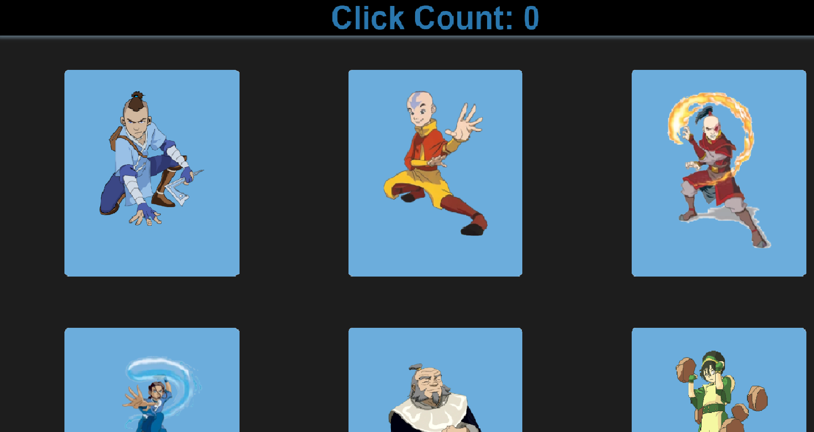

# Avatar Card Game

 

### Technologies Used
 
| Technology | Use 
| --- | --- |
javascript | front-end and back-end language|
nodejs | used for backend js |
React | library |
shuffle npm | for shuffling cards into different order|
yarn | package manager of choice |

## Getting Started

The goal of this game is to click each of the 12 cards once. Enjoy !!

https://avatar-card-tribute-game-89458.herokuapp.com/
